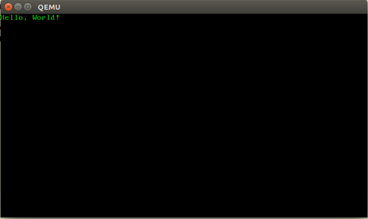

# *HYDROGEN*
A bare-bones kernel that prints "Hello, World!" on the screen.  

## *REQUIREMENTS*
**1. QEMU:**  
    QEMU is a machine emulator and virtualizer.  
    Install it using:  
        1. Linux: `$ sudo apt-get install qemu-system`  
        2. Mac OS: `brew install qemu`

**2. NASM:**  
  NASM is an assembler and disassembler for the Intel x86 architecture.  
  Install it using: `$ sudo apt-get install nasm`

## *BUILD INSTRUCTIONS*  
### Method 1 (_is automated, try Method 2 to get a more geeky feeling_):  
  
  1. Build kernel executable: `./buildkernel.sh`  
  2. Place the kernel executable in the grub image: `./buildimage.sh`  
  3. Run the kernel: `./run.sh`  

### Method 2:  

#### Build the kernel executable:
  1. Use **NASM** to produce an object file of `entry.asm`.  
    * ``nasm -f elf32 entry.asm -o entry.o``  
    * `elf32` flag is used to produce a 32-bit ELF object file.

  2. Use **cc** to produce an object file of `c_start.c`.
    * ``cc -m32 -c -Wall c_start.c``  
    * From the man page of gcc:  
      `-m32`  
      `Generate code for a 32-bit or 64-bit environment.`  
      `The -m32 option sets "int", "long", and pointer`  
      `types to 32 bits, and generates code that runs on`  
      `any i386 system.`  

  3. Use **ld** (the GNU Linker) to link the above object files into a single executable (*hydrogen*).
    * ``ld -m elf_i386 -T link.ld -o hydrogen c_start.o entry.o``
    * `elf_i386` flag is used to emulate the elf_i386 linker.
    * `link.ld` is a linker template file.

#### Modify the grub image:  
##### 1. Setup `grub.img` as a loop device:
    sudo losetup /dev/loop0 references/grub.img  

##### 2. Create a directory in the `mnt` folder:
    sudo mkdir /mnt/sos

##### 3. Mount the `sos` directory at `/dev/loop0`:
    sudo mount /dev/loop0 /mnt/sos

##### 4. Copy kernel executable to `/mnt/sos/SOS`:
    sudo cp hydrogen /mnt/sos/SOS

##### 5. Synchronize data on disk with memory:
    sudo sync

##### 6. Unmount loop device:
    sudo umount /dev/loop0
  
##### 7. Delete loop:
    sudo losetup -d /dev/loop0

#### Run:
##### `qemu-system-i386 -fda references/grub.img`  
  * `-fda` option tells qemu to use grub.img as a floppy disk image.
